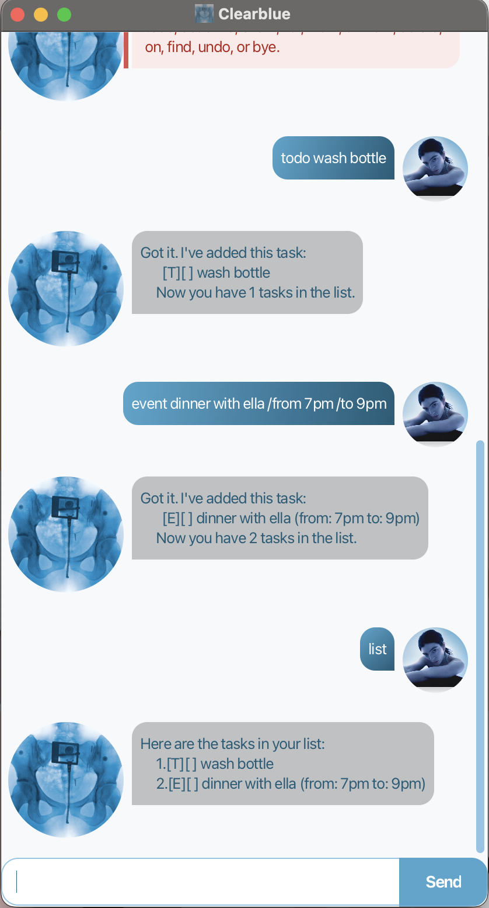

# Clearblue User Guide



Clearblue is a desktop chatbot that helps you track your tasks — todos, deadlines, and events — through simple typed commands. If you can type fast, Clearblue can manage your tasks faster than a traditional point-and-click app.

## Quick start

1. Ensure you have Java 25 installed on your computer.
2. Clone this repository, then from the project root run:
   ```
   ./gradlew shadowJar
   java -jar build/libs/clearblue.jar
   ```
3. The Clearblue window should appear, ready for your first command.

## Notes on the command format

- Words in `UPPER_CASE` are parameters you supply, e.g. in `todo DESCRIPTION`, `DESCRIPTION` is a parameter you replace with your own text.
- A date or time value written as `yyyy-MM-dd` (e.g. `2019-12-25`) is understood as a real calendar date; anything else you type is kept and shown back exactly as you typed it.

## Features

### Adding a todo: `todo`

Adds a task with no date attached.

Format: `todo DESCRIPTION`

Example: `todo read book`
```
Got it. I've added this task:
  [T][ ] read book
Now you have 1 tasks in the list.
```

### Adding a deadline: `deadline`

Adds a task that needs to be done by a specific date or time.

Format: `deadline DESCRIPTION /by DATE_OR_TIME`

Example: `deadline return book /by 2019-06-06`
```
Got it. I've added this task:
  [D][ ] return book (by: Jun 06 2019)
Now you have 2 tasks in the list.
```

### Adding an event: `event`

Adds a task that spans a start and an end date or time.

Format: `event DESCRIPTION /from START /to END`

Example: `event project meeting /from 2019-08-06 /to 2019-08-06`
```
Got it. I've added this task:
  [E][ ] project meeting (from: Aug 06 2019 to: Aug 06 2019)
Now you have 3 tasks in the list.
```

If `START` and `END` are both real (`yyyy-MM-dd`) dates, `START` must be before `END`.

### Listing all tasks: `list`

Shows every task currently in your list, numbered from 1.

Format: `list`

### Marking a task as done: `mark`

Marks the given task as done.

Format: `mark INDEX`

Example: `mark 2`

### Marking a task as not done: `unmark`

Marks the given task as not done.

Format: `unmark INDEX`

Example: `unmark 2`

### Deleting a task: `delete`

Removes the given task from your list.

Format: `delete INDEX`

Example: `delete 2`

### Finding tasks by keyword: `find`

Shows the tasks whose description contains the given keyword, matched case-insensitively.

Format: `find KEYWORD`

Example: `find book`

### Viewing tasks on a date: `on`

Shows the deadlines and events that fall on the given date. Todos are never shown, since they carry no date.

Format: `on yyyy-MM-dd`

Example: `on 2019-06-06`

### Undoing your last change: `undo`

Reverses your most recently added, deleted, marked, or unmarked task. Only one step of undo is available — undoing twice in a row, with nothing new done in between, has nothing left to undo.

Format: `undo`

### Exiting the program: `bye`

Closes Clearblue.

Format: `bye`

## Saving the data

Clearblue automatically saves your task list to disk after every change. There's no need to save manually, and your tasks will still be there the next time you open Clearblue.

## FAQ

**Q: How do I transfer my data to another computer?**

A: Copy over the `data/clearblue.txt` file created next to where you run Clearblue from.

## Command summary

| Action | Format | Example |
|--------|--------|---------|
| Todo | `todo DESCRIPTION` | `todo read book` |
| Deadline | `deadline DESCRIPTION /by DATE` | `deadline return book /by 2019-06-06` |
| Event | `event DESCRIPTION /from START /to END` | `event meeting /from 2019-08-06 /to 2019-08-06` |
| List | `list` | |
| Mark | `mark INDEX` | `mark 2` |
| Unmark | `unmark INDEX` | `unmark 2` |
| Delete | `delete INDEX` | `delete 2` |
| Find | `find KEYWORD` | `find book` |
| On | `on yyyy-MM-dd` | `on 2019-06-06` |
| Undo | `undo` | |
| Bye | `bye` | |
